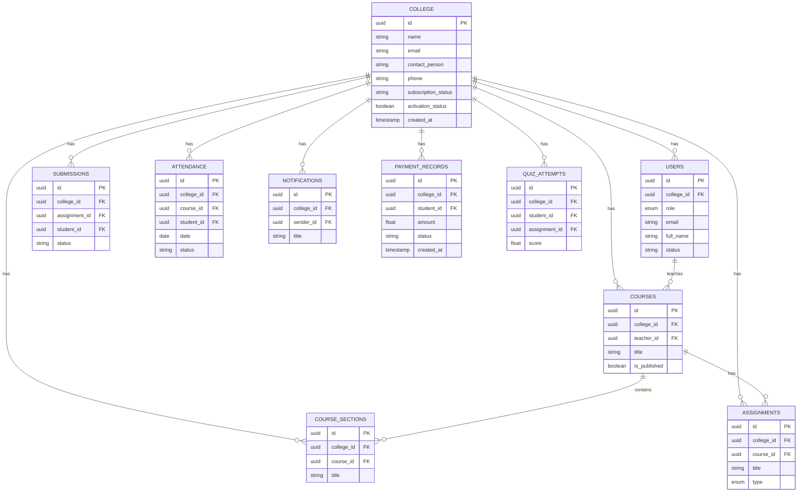

# Multi-Tenant SaaS LMS ER Diagram

```mermaid
erDiagram
    COLLEGE {
        uuid id PK
        string name
        string email
        string contact_person
        string phone
        string subscription_status
        boolean activation_status
        timestamp created_at
    }

    USERS {
        uuid id PK
        uuid college_id FK
        enum role
        string email
        string full_name
        string status
    }

    COURSES {
        uuid id PK
        uuid college_id FK
        uuid teacher_id FK
        string title
        boolean is_published
    }

    COURSE_SECTIONS {
        uuid id PK
        uuid college_id FK
        uuid course_id FK
        string title
    }

    ASSIGNMENTS {
        uuid id PK
        uuid college_id FK
        uuid course_id FK
        string title
        enum type
    }
    
    SUBMISSIONS {
        uuid id PK
        uuid college_id FK
        uuid assignment_id FK
        uuid student_id FK
        string status
    }

    ATTENDANCE {
        uuid id PK
        uuid college_id FK
        uuid course_id FK
        uuid student_id FK
        date date
        string status
    }

    NOTIFICATIONS {
        uuid id PK
        uuid college_id FK
        uuid sender_id FK
        string title
    }
    
    PAYMENT_RECORDS {
        uuid id PK
        uuid college_id FK
        uuid student_id FK
        float amount
        string status
        timestamp created_at
    }

    QUIZ_ATTEMPTS {
        uuid id PK
        uuid college_id FK
        uuid student_id FK
        uuid assignment_id FK
        float score
    }

    COLLEGE ||--o{ USERS : "has"
    COLLEGE ||--o{ COURSES : "has"
    COLLEGE ||--o{ COURSE_SECTIONS : "has"
    COLLEGE ||--o{ ASSIGNMENTS : "has"
    COLLEGE ||--o{ SUBMISSIONS : "has"
    COLLEGE ||--o{ ATTENDANCE : "has"
    COLLEGE ||--o{ NOTIFICATIONS : "has"
    COLLEGE ||--o{ PAYMENT_RECORDS : "has"
    COLLEGE ||--o{ QUIZ_ATTEMPTS : "has"

    USERS ||--o{ COURSES : "teaches"
    COURSES ||--o{ COURSE_SECTIONS : "contains"
    COURSES ||--o{ ASSIGNMENTS : "has"
```
