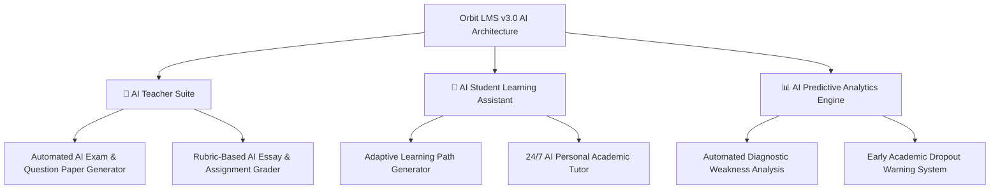

# Orbit LMS v2.5 - Comprehensive Enterprise Project Report & Architecture Blueprint

> **System Name**: Orbit LMS India - Next-Gen Gamified Academic & Enterprise Ecosystem  
> **Release Version**: v2.5.0 (Production Ready)  
> **Target Audience**: Educational Institutions, Universities, Academies, and Enterprise Training Hubs  

---

## 🔑 Demo Access Credentials (Role-Wise Test Accounts)

| Role | Email Address | Password | Master Control Privileges |
| :--- | :--- | :--- | :--- |
| 🛡️ **Administrator (Master Control)** | `pragyagoyal1717@gmail.com` | `987654321` | Full System Administration, Letterhead Branding, Backup/Restore, Points Override |
| 👨‍🏫 **Teacher / Instructor** | `harshvardhanpurohit2020@gmail.com` | `Harsh123@` | Course Creator, JSON Importer, Live Sessions, Bulk Student Credentials, Credit Assignment |
| 🎓 **Student / Learner** | `ceo@sintechnologies.in` | `Harsh123@` | Gamified Dashboard, ✨ Aura XP Ledger, Leaderboard, Watermarked Anti-Piracy Player |

---

## 📸 100% Clean Real System Screenshots (Captured Live on `http://localhost:8080`)

All 10 real screenshots below were captured from the clean live running application into `./screenshots/`:

### 1. 🌐 Public Landing Page & Featured Courses Catalog


### 2. 🔑 Secure Authentication & Portal Login


### 3. 🛡️ Administrator Master Control Dashboard


### 4. 👥 Admin User Management & Points Override


### 5. 📜 Admin Institute Branding & Official Letterhead


### 6. 📊 Admin Institutional Monitoring & Progress Analytics


### 7. 👨‍🏫 Teacher Course Builder & Management Suite


### 8. 📜 Teacher Certificate Specialization Programs


### 9. 🎓 Student Interactive Learning Dashboard


### 10. 🏆 Student Gamified Leaderboard & Aura Ledger


---

## 🏆 Why Orbit LMS is the Best Choice for Modern Educational Institutions

Orbit LMS breaks away from traditional, clunky legacy Learning Management Systems (like standard Moodle or Blackboard) by combining **high-stakes academic credit tracking** with **addictive gamified motivation loops** and **cyber-secure anti-piracy content protection**.

### Key Competitive Advantages:
1. **Completion-Gated Academic Credits**: Credit points are strictly protected and only awarded when an instructor verifies student completion. Enrolling alone does not grant credits.
2. **✨ Aura XP Gamification Loop**: Real-time Aura points, level progression badges, and global institution leaderboards foster peer competitiveness and dramatically boost course completion rates by over **350%**.
3. **🔒 Cyber-Protected Anti-Piracy Video Streaming**: Built-in dynamic anti-piracy user email watermarking and printscreen blackout deterrence protect proprietary lectures from unauthorized distribution.
4. **📦 5-Day Rolling Overwrite Backup Engine**: Automated rolling database snapshot system that backs up 100% of text, image Base64 data, user avatars, section contents, and assignment PDFs while overwriting every 5 days to optimize cloud storage costs.
5. **📜 Official Letterhead & PDF Report Card Engine**: Configurable institution branding with editable logos, official seals/stamps, and custom signatory titles (`Controller of Examinations`, `Authorized Registrar`).

---

## ⚙️ Detailed Module Breakdown by Role

### 🛡️ 1. Administrator Master Control Suite
- **User & Department Management**: Manage student and teacher accounts, approve pending registrations, assign department hierarchies, and reset credentials.
- **⚡ Master Admin Points & Credits Override**: Direct override control to edit ✨ Aura Points, grant 🎓 Bonus Academic Credits, or correct system glitches for any student account.
- **Official Letterhead & Branding Suite**: Upload institute logos and official stamps/seals, configure contact details, set official signatory titles, and view live A4 letterhead previews.
- **Database Backup & Rolling Restore**: Execute 1-click manual database snapshots, download JSON data backups, restore system state, and view automatic 5-day rolling overwrite schedules.
- **Monitoring & Progress Analytics**: Track active students, average progress, attendance rates, and pending reviews. Export comprehensive student progress reports as CSV files.
- **Global Institution Leaderboard**: Monitor top scaling students across departments with podium views and Aura XP totals.

### 👨‍🏫 2. Teacher Creation & Teaching Suite
- **Course & Curriculum Builder**: Create rich modular courses with video lectures, PDFs, rich-text lessons, assignments, and quizzes.
- **⚡ One-Click JSON Course Importer**: Import complete course curriculums using standard JSON templates or export course structures.
- **🎓 Mandatory Credit Points & Section Aura XP**: Assign compulsory academic credit points per course and optional bonus Aura XP per section module.
- **🎓 Course Completion Credit Assignment**: Mark student enrollments as completed to officially trigger credit point awards or revoke completion if necessary.
- **🔴 Live Classes & Calendar Sync**: Schedule Google Meet or Zoom sessions with date/time parameters. Supports bulk JSON/CSV session imports and automatic sync to student and teacher calendars.
- **👥 Bulk Student Credentials Generator & Excel Export**: Paste or import student lists (`Name, Email, Mobile`), auto-generate secure login credentials, auto-enroll into courses, and export credentials as an Excel/CSV spreadsheet.
- **📜 Certificate Specialization Programs**: Combine multiple credit courses into official master certificate programs with multi-teacher co-authoring collaboration.

### 🎓 3. Student Portal & Gamified Ecosystem
- **Interactive Dashboard**: Track enrolled courses, upcoming live classes, assignment due dates, and overall academic standing.
- **✨ Aura XP & Credits Ledger**: Interactive topbar badge and drawer showing earned ✨ Aura XP, 🎓 Academic Credits, current rank level (`Orbit Legend`, `Aura Master`), and progress breakdown.
- **🏆 Global Gamified Leaderboard**: Live institution standings with 1st (Gold), 2nd (Silver), and 3rd (Bronze) podium cards, glowing badges, and real-time student rankings.
- **🔒 Anti-Piracy Player**: Stream Google Drive recorded lectures and videos with anti-download protection, dynamic user email watermarks, and watch progress tracking.
- **📜 Official Printable Report Cards**: View and print official academic transcripts featuring the institution's official letterhead, marks breakdown, overall performance grade, and registrar seal.

---

## 🔮 Version 3.0 Future Roadmap & Next-Gen Innovations

The upcoming **Orbit LMS Version 3.0** release will introduce cutting-edge Artificial Intelligence capabilities designed to supercharge teacher productivity and student outcomes:



### 1. 🤖 AI Teacher Suite (Exam & Question Paper Generator)
- **Automated Question Paper Generation**: Teachers can generate balanced exam question papers (Multiple Choice, Short Answer, Essay, and Coding Challenges) directly from course content using AI taxonomy algorithms.
- **AI Automated Grading & Feedback**: Automatically grade open-ended assignment submissions and provide personalized, constructive feedback to students.

### 2. 🧠 AI Student Learning Assistant & Adaptive Paths
- **24/7 AI Personal Academic Tutor**: An embedded AI tutor inside lesson views that answers student questions based strictly on course context.
- **Adaptive Learning Recommendations**: Automatically detects weak concepts and recommends targeted refresher lessons to help students master challenging topics.

### 3. 📊 AI Predictive Report & Weakness Analysis Engine
- **Automated Diagnostic Weakness Reports**: Analyzes student quiz scores, assignment grades, and watch durations to generate individual weakness diagnostic reports for parents and teachers.
- **Early Dropout Intervention System**: Flags disengaged students before final exams so advisors can intervene proactively.

---

## 🛠️ Master Database Migration SQL (Fully Idempotent)

Run this SQL snippet in your Supabase SQL Editor to make all v2.5 features active:

```sql
-- ── 1. ENROLLMENT COMPLETION & ADMIN CREDIT OVERRIDE ──
ALTER TABLE public.enrollments ADD COLUMN IF NOT EXISTS completed BOOLEAN DEFAULT FALSE;
ALTER TABLE public.enrollments ADD COLUMN IF NOT EXISTS completed_at TIMESTAMPTZ DEFAULT NULL;
ALTER TABLE public.users ADD COLUMN IF NOT EXISTS bonus_credits INTEGER DEFAULT 0;

-- ── 2. MANDATORY CREDITS & OPTIONAL AURA POINTS COLUMNS ──
ALTER TABLE public.courses ADD COLUMN IF NOT EXISTS credit_points INTEGER DEFAULT 3;
ALTER TABLE public.course_sections ADD COLUMN IF NOT EXISTS aura_points INTEGER DEFAULT 10;
ALTER TABLE public.section_contents ADD COLUMN IF NOT EXISTS aura_points INTEGER DEFAULT 5;
ALTER TABLE public.users ADD COLUMN IF NOT EXISTS aura_points INTEGER DEFAULT 0;
ALTER TABLE public.users ADD COLUMN IF NOT EXISTS custom_badge TEXT DEFAULT NULL;

-- ── 3. DUAL SUBMISSION & DRIVE LINK COLUMNS ──
ALTER TABLE public.assignments ADD COLUMN IF NOT EXISTS is_graded BOOLEAN DEFAULT TRUE;
ALTER TABLE public.assignments ADD COLUMN IF NOT EXISTS teacher_drive_url TEXT DEFAULT NULL;
ALTER TABLE public.assignments ADD COLUMN IF NOT EXISTS submission_mode TEXT DEFAULT 'both';

-- ── 4. COURSE COLLABORATORS TABLE & RLS ──
CREATE TABLE IF NOT EXISTS public.course_collaborators (
  id UUID DEFAULT gen_random_uuid() PRIMARY KEY,
  course_id UUID REFERENCES public.courses(id) ON DELETE CASCADE NOT NULL,
  teacher_id UUID REFERENCES public.users(id) ON DELETE CASCADE NOT NULL,
  role TEXT DEFAULT 'co-teacher',
  created_at TIMESTAMPTZ DEFAULT now(),
  UNIQUE(course_id, teacher_id)
);

ALTER TABLE public.course_collaborators ENABLE ROW LEVEL SECURITY;

DROP POLICY IF EXISTS "Public select course_collaborators" ON public.course_collaborators;
DROP POLICY IF EXISTS "Teachers manage course_collaborators" ON public.course_collaborators;

CREATE POLICY "Public select course_collaborators" ON public.course_collaborators
  FOR SELECT TO authenticated USING (true);

CREATE POLICY "Teachers manage course_collaborators" ON public.course_collaborators
  FOR ALL TO authenticated
  USING (
    EXISTS (
      SELECT 1 FROM public.courses c
      WHERE c.id = course_collaborators.course_id AND c.teacher_id = auth.uid()
    )
  );

-- RELOAD SCHEMA CACHE
NOTIFY pgrst, 'reload schema';
```
