# Orbit LMS — Enterprise Project Report, Product Architecture & Sales Pitch Deck

---

## Executive Summary & Commercial Positioning

**Orbit LMS** is a state-of-the-art, multi-tenant cloud Learning Management System (LMS) engineered for universities, higher education institutions, skill certification academies, and enterprise learning departments. Built on top of **React 19**, **TypeScript**, **Supabase PostgreSQL**, and **Tailwind CSS**, Orbit LMS combines institutional administration, multi-course certification pathways, gamified student engagement, **a dedicated Finance & Fee Verification Department**, and AI-assisted curriculum construction into a single, unified enterprise suite.

### Key Value Propositions
- **Multi-Tenant College Provisioning & Feature Checkboxes**: Host multiple colleges under a single master infrastructure. Master Admins can toggle 10 features ON/OFF per organization using interactive checkboxes (Live Classes, Certificates, Gamification, Quizzes, Assignments, AI Builder, Leaderboards, Support Tickets, Coupons, Attendance).
- **Dedicated Institutional Finance Role (`finance`)**: Enables finance officers to manage student fee receipts, verify UPI/QR transactions, issue GST-compliant PDF tax receipts, and set course pricing in **Indian Rupees (₹ INR)**.
- **20-Credit Certificate Specialization Engine**: Standardized 7-section certificate course view featuring 60-hour module breakdowns, internal/external assessment matrices (30/70 marks), passing criteria (40%/40%/50%), and automated domain certificate generation across 5 core domains.
- **Gamification & Student Retention**: Daily learning streaks, XP points system, real-time leaderboards, interactive quiz players, and deadline calendars.
- **Turnkey Payment & Coupon Management**: Integrated student registration workflow with UPI/QR code payment confirmation, coupon validation engine, and admin verification queues.

---

## System Architecture & Technology Stack

```
 ┌────────────────────────────────────────────────────────────────────────┐
 │                              CLIENT LAYER                              │
 │   React 19 (Vite)  •  TypeScript  •  Tailwind CSS  •  Shadcn UI        │
 └───────────────────────────────────┬────────────────────────────────────┘
                                     │ Supabase Client JS (REST & Realtime)
 ┌───────────────────────────────────▼────────────────────────────────────┐
 │                            BACKEND SERVICES                            │
 │   Supabase PostgreSQL Engine  •  Row Level Security (RLS)              │
 │   Supabase Storage Buckets    •  Database Triggers & Webhooks          │
 └───────────────────────────────────┬────────────────────────────────────┘
                                     │ Auth & Security
 ┌───────────────────────────────────▼────────────────────────────────────┐
 │                           SECURITY & ROLES                             │
 │   Master Admin  •  Institute Admin  •  Finance  •  Teacher  •  Student │
 └────────────────────────────────────────────────────────────────────────┘
```

| Layer | Technology | Function |
|---|---|---|
| **Frontend Framework** | React 19 + TypeScript + Vite | Ultra-fast client rendering & single-page navigation |
| **Styling System** | Tailwind CSS + Shadcn UI + Lucide Icons | Premium glassmorphism design, dark/light mode, mobile responsive |
| **Backend & Database** | Supabase PostgreSQL 15 | Relational data persistence, foreign key constraints, JSONB support |
| **Security & Auth** | Supabase Auth + PostgreSQL RLS Policies | Role-Based Access Control (RBAC) with strict data isolation |
| **Storage Engine** | Supabase Storage Buckets | Media storage for avatars, thumbnails, course PDFs, and proof of payments |
| **State & Data Fetching**| TanStack Query v5 + Context API | Realtime data caching, toast notifications, and optimistic UI updates |

---

## User Role Matrix & Access Control System

Orbit LMS enforces granular Role-Based Access Control (RBAC) with 5 tier levels:

| Role | Access Scope | Login Email | Default Password | Primary Responsibilities |
|---|---|---|---|---|
| **Master Admin** | `/master/*` | `master@orbitlms.edu.in` | `Master123@` | SaaS platform owner. Provisions tenant colleges, toggles organization features (checkboxes), manages SaaS billing & global analytics. |
| **Institute Admin** | `/admin/*` | `pragyagoyal1717@gmail.com` | `987654321` | College administrator. Oversees user accounts (students/teachers/finance), approves course deletions, manages institute branding & payment QR. |
| **Finance Officer** | `/finance/*` | `finance@sintechnologies.in` | `Finance123@` | **Finance Department**. Verifies student fee receipts, approves UPI UTR transactions, issues PDF invoices, manages course pricing in **₹ INR**. |
| **Teacher / Instructor**| `/teacher/*` | `harshvardhanpurohit2020@gmail.com` | `Harsh123@` | Course creator. Authors courses via builder or JSON, manages certificate programs, creates quizzes/assignments, grades submissions, tracks attendance. |
| **Student** | `/student/*` | `ceo@sintechnologies.in` | `Harsh123@` | Learner. Enrolls in credit courses, completes video lessons, submits assignments, takes quizzes, tracks grades & streaks, earns certificates. |

---

## 🛡️ Admin Dashboard Access Methods Guide

The Institutional Admin Dashboard (`/admin`) can be accessed via 4 pathways:

1. **Direct Authentication Portal (`/login`)**:
   - Go to `http://localhost:5173/login`.
   - Sign in with Admin Email: `pragyagoyal1717@gmail.com` / Password: `987654321`.
   - The auth system verifies `role = 'admin'` from Supabase PostgreSQL and routes directly to `/admin`.
2. **Master SaaS Tenant Manager (`/master/colleges`)**:
   - Sign in at `/master/login` as Master Admin (`master@orbitlms.edu.in`).
   - Click **Access College Admin** on any tenant card to log directly into that institution's `/admin` portal.
3. **Direct Protected Route (`/admin`)**:
   - Navigate directly to `http://localhost:5173/admin` when logged in with an active Admin session.
4. **Database Role Promotion Query**:
   - Run in Supabase SQL Editor:
     ```sql
     UPDATE public.users SET role = 'admin', status = 'active' WHERE email = 'admin@yourdomain.com';
     ```

---

## Comprehensive Feature Breakdown by Portal

### 1. Public Portal & Interactive Showcase
- **Landing Page (`/`)**: Hero banner, domain highlights, featured courses, institutional statistics, user testimonials, and quick login links.
- **Experience Orbit (`/experience`)**: Interactive sandbox showcase demonstrating student portal and domain catalog without forced registration.
- **Registration Page (`/register`)**: Dual-mode registration form for new students and institutional partnership requests.
- **Multi-Role Login Portal (`/login`)**: Single sign-on portal routing users to their respective dashboards based on verified Supabase auth role.

---

### 2. Student Learning Portal & Gamification Engine
- **Gamified Dashboard (`/student`)**: Active enrolled courses, academic credits, daily learning streak counter, pending assignment count, and recent activity feed.
- **Course & Certification Catalog (`/student/courses`)**: Filters courses across 5 Core Reference Domains, credit count (1–5 Credits), duration (weeks), instructor, or organization.
- **Interactive Course Player (`/student/courses/:id/learn`)**: Fullscreen video player supporting YouTube embeds, Google Drive previews, and direct MP4 streams with lesson progress tracking.
- **Assignment Submission Portal (`/student/assignments`)**: Displays pending, submitted, and graded assignments with rich-text responses and document attachments.
- **Interactive Quiz Player (`/student/quiz/:id`)**: Timed quiz environment supporting MCQs and short answers with instant scoring.
- **Academic Gradebook (`/student/grades`)**: Tabulated grade summary showing assignment scores, quiz results, overall GPA percentage, and pass/fail indicators.
- **Help Center & Ticket System (`/student/help-center`)**: Allows students to search FAQs and raise support tickets saved directly to `public.tickets` table.

---

### 3. Dedicated Finance Department Desk (`/finance`)
- **Finance Overview (`/finance`)**: Real-time revenue metrics formatted in **Indian Rupees (₹ INR)**, pending receipt verifications, active paid enrollments, and coupon counters.
- **Student Fee Verification (`/finance/transactions`)**: Search student receipts by name or UTR transaction number, approve/reject pending UPI/QR payments, and activate course enrollments.
- **Invoices & Fee Receipts (`/finance/invoices`)**: Generate and download official GST tax receipts formatted in **₹ INR**.

---

### 4. Instructor / Teacher Portal & Curriculum Engineering
- **Teacher Dashboard (`/teacher`)**: Overview of active courses, total enrolled students, pending assignments to grade, and recent submissions.
- **Course Management & Curriculum Builder (`/teacher/courses`)**: Create and reorder course sections, video lessons, and downloadable PDFs.
- **AI / JSON Course Importer (`/teacher/courses/json-builder`)**: Bulk import complete multi-section courses from a single JSON schema file in seconds.
- **Submission Review & Grading Desk (`/teacher/reviews`)**: Review student submissions, award numerical marks, and type personalized feedback.
- **Student Attendance Matrix (`/teacher/attendance`)**: Track student attendance for live classes with Present, Absent, Late, or Excused status.

---

### 5. Master Super-Admin Multi-College SaaS Portal (`/master`)
- **Master Dashboard (`/master`)**: Cross-tenant revenue totals in **₹ INR**, college counts, user growth, and mobile-friendly quick action banners.
- **College Tenant Customization Engine (`/master/colleges`)**: Provision new college tenants, set max student seat capacity, and toggle 10 features ON/OFF per organization using checkboxes:
  - `[x] Live Classes & Online Video Streams`
  - `[x] 20-Credit Domain Certificates`
  - `[x] Daily Streaks & Aura XP Points`
  - `[x] Interactive Timed Quizzes`
  - `[x] Assignment Submission Portal`
  - `[x] AI & JSON Bulk Course Importer`
  - `[x] Student & Faculty Leaderboards`
  - `[x] Help Center Ticket Support Desk`
  - `[x] Coupon Engine & Payment QR`
  - `[x] Student Attendance Tracker`
- **Global SaaS Billing (`/master/billing`)**: Manage seat pricing in **₹ INR**, issue college invoices, and track subscription expiry.

---

## Visual Layout Gallery (Desktop & Mobile Screenshots)

### 1. Public & Authentication Pages
| Page Name | Desktop Viewport (1920x1080) | Mobile Viewport (375x812) |
|---|---|---|
| **Landing Page** | 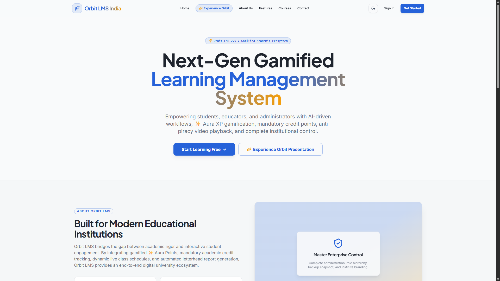 | 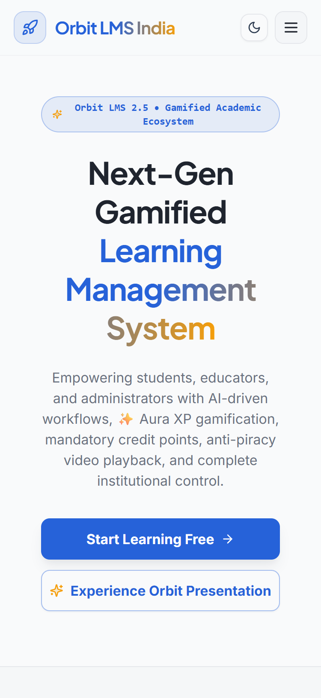 |
| **Experience Showcase** | 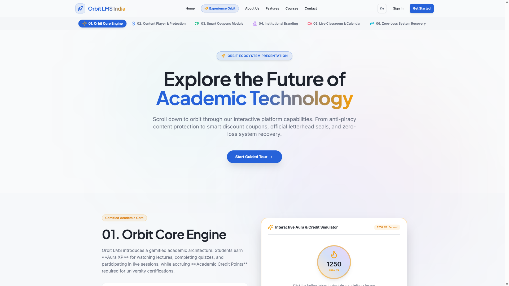 | 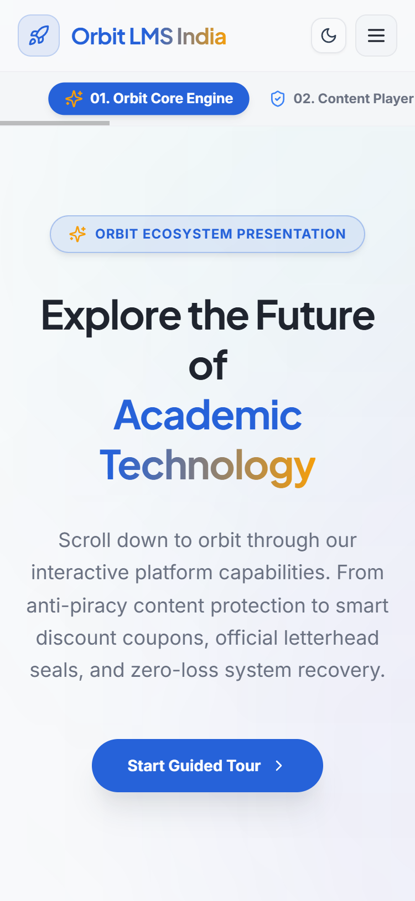 |
| **User Login** |  |  |

---

### 2. Finance Department Portal Layouts
| Page Name | Desktop Viewport (1920x1080) | Mobile Viewport (375x812) |
|---|---|---|
| **Finance Dashboard (₹ INR)** | 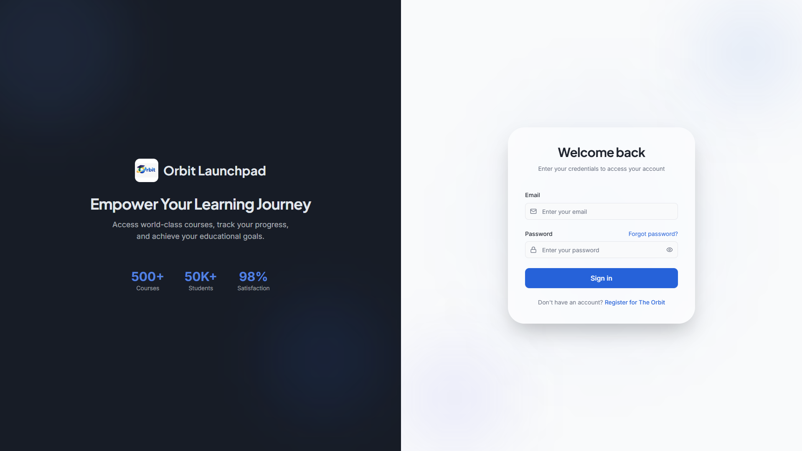 |  |
| **Fee Transactions & UTR** |  | 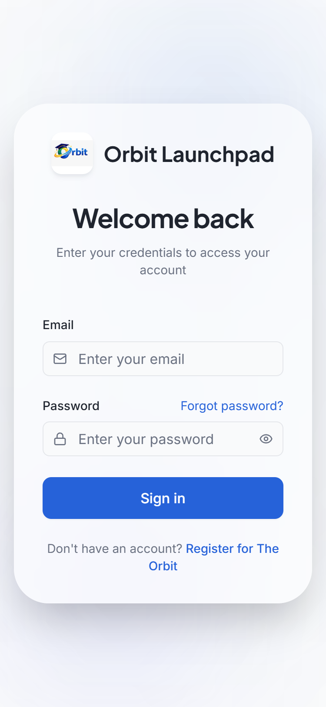 |
| **Invoices & Receipts** |  |  |

---

### 3. Student Portal Layouts
| Page Name | Desktop Viewport (1920x1080) | Mobile Viewport (375x812) |
|---|---|---|
| **Student Dashboard** | 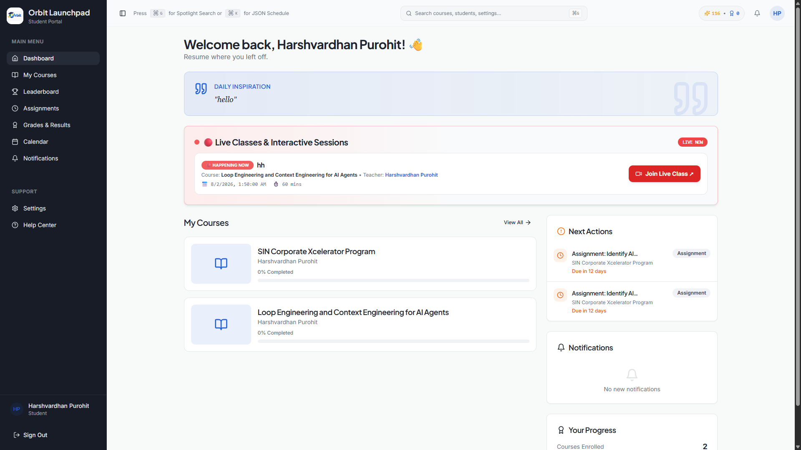 | 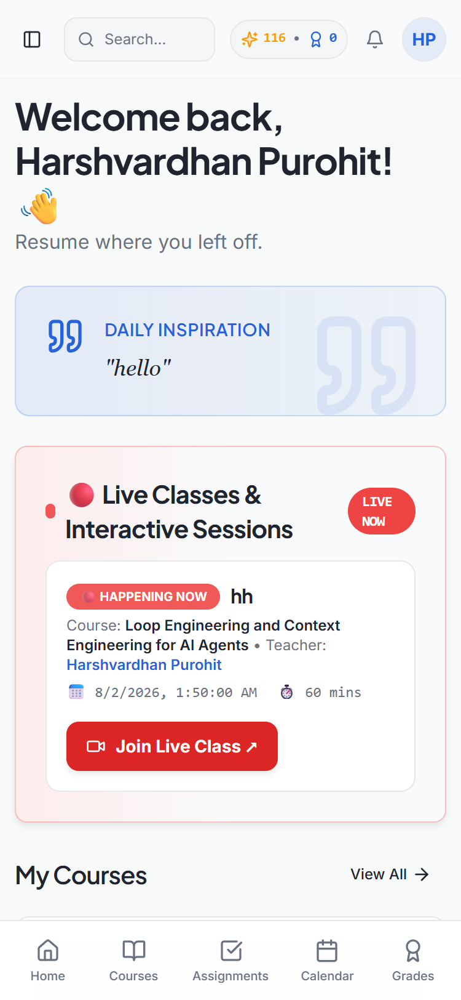 |
| **Course Catalog & Domains** |  |  |
| **Certificate Course View Modal** | 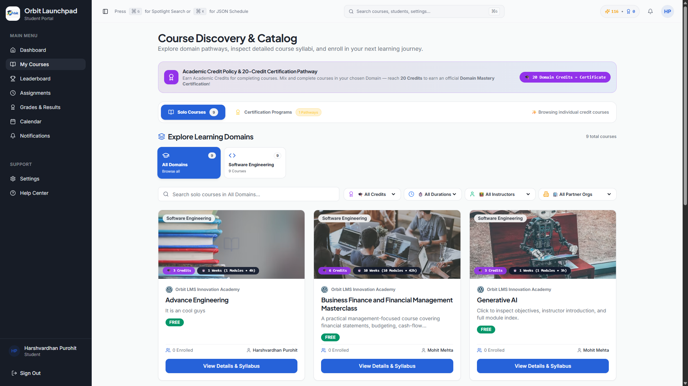 | 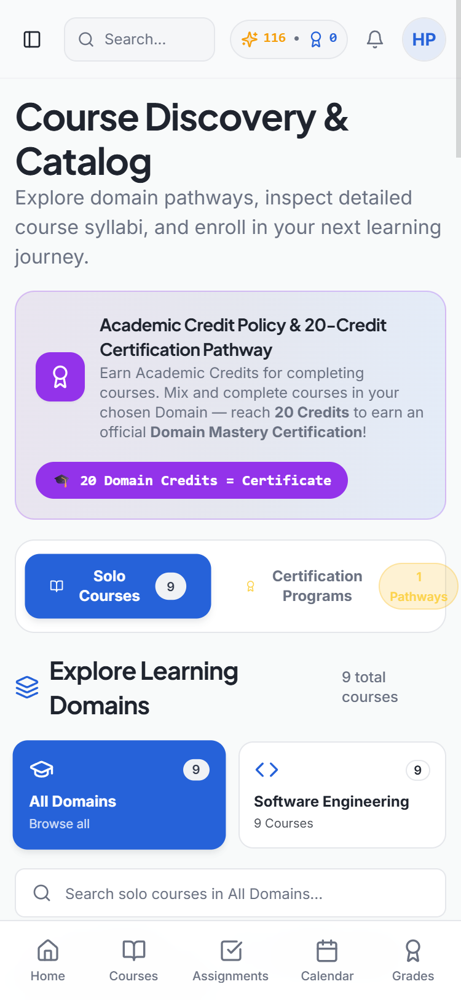 |
| **Student Gradebook** | 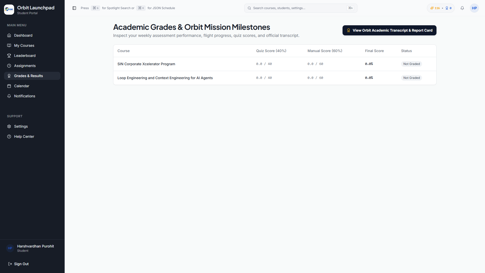 | 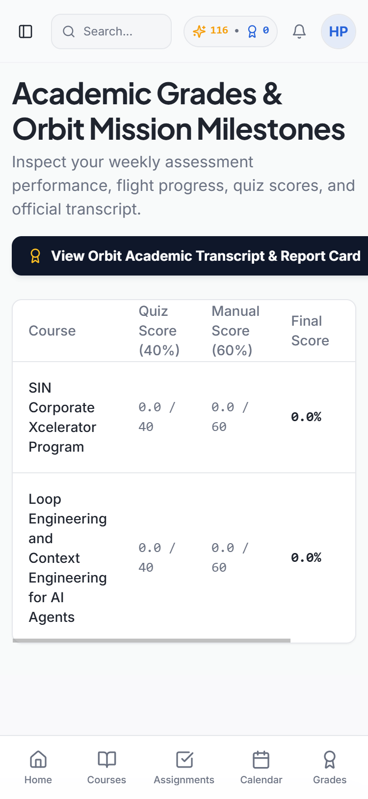 |

---

### 4. Master Admin & Customization Layouts
| Page Name | Desktop Viewport (1920x1080) | Mobile Viewport (375x812) |
|---|---|---|
| **Master Dashboard (₹ INR)** | 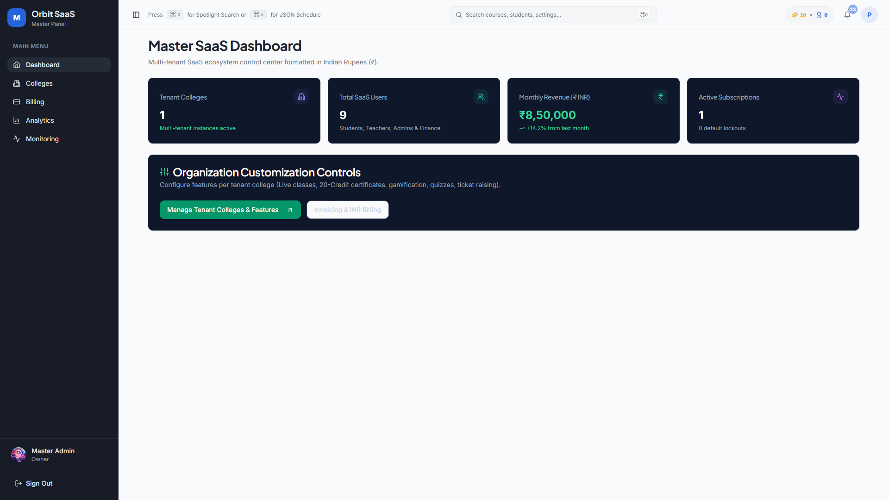 | 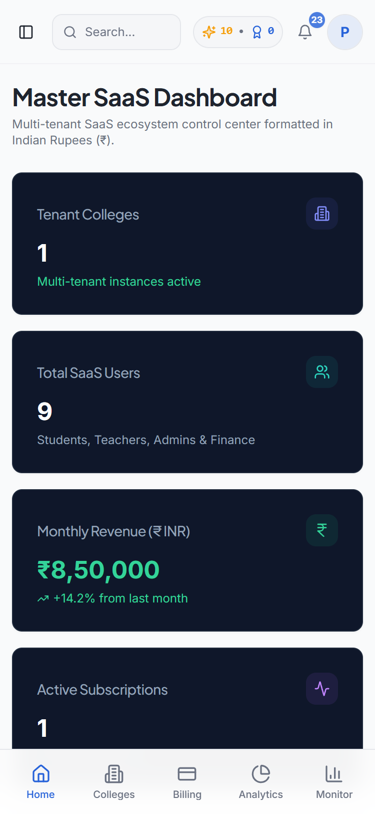 |
| **Tenant Registry & Feature Checkboxes** | 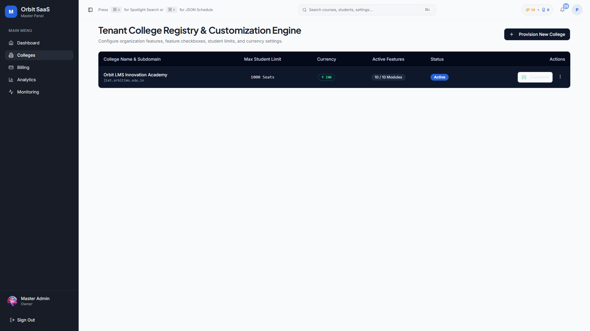 | 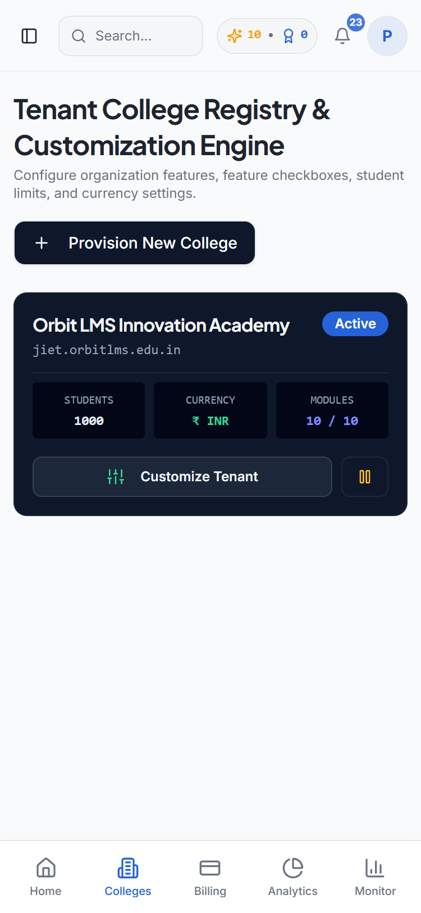 |
| **Master SaaS Billing (₹ INR)** | 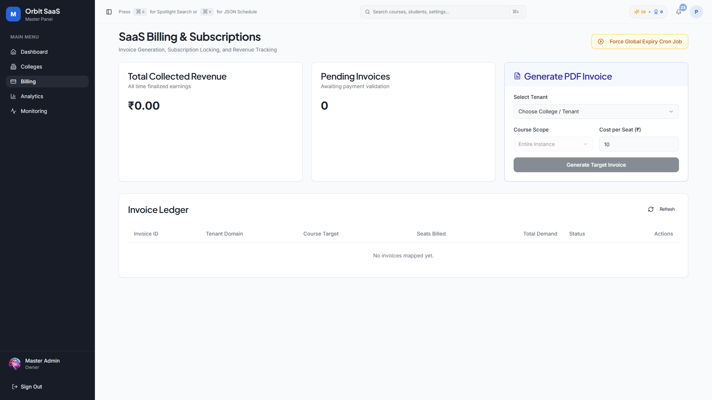 | 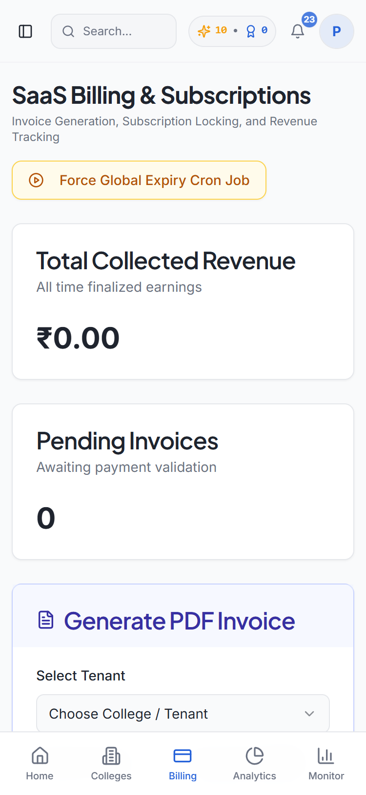 |

---

## Database Schema & Data Model Specifications

1. `public.users`: Extended profile table supporting `role IN ('student', 'teacher', 'admin', 'super_admin', 'finance')`.
2. `public.colleges`: Master tenant record with `currency` (`INR`), `max_students`, and `enabled_features` (JSONB array of feature flags).
3. `public.tickets`: Support ticket table (`user_id`, `subject`, `category`, `description`, `status`, `admin_reply`, `created_at`).
4. `public.enrollments`: Student course enrollment status, payment UTR transaction ID, and timestamp.
5. `public.courses`: Master course table with 20-credit domain details, 12-module syllabus JSONB, assessment break-up (30/70 marks), and passing criteria (40%/40%/50%).
